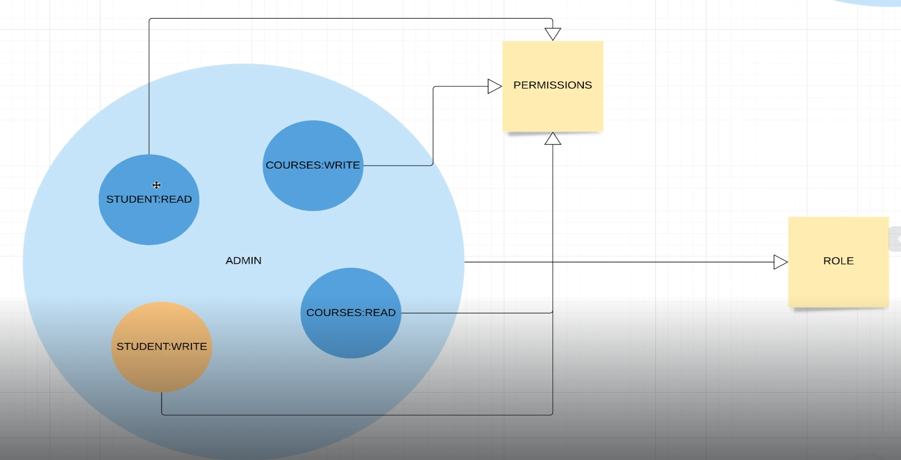

# Spring-Security

##  Prerequisites

In order to work with Spring Security Tutorial

- JDK 11.0.24
- Maven 3.8.8

## Getting Started

After Creating the project with Spring Initialize, we choose these parameters

- Java 11
- Spring Web

### Adding Student Package

We Add Student RestController and model inside Student Package to the project 


### testing the Endpoint

**http://localhost:8080/api/v1/students/1**


## Setting Spring Security 

### Adding Spring Security dependency to the pom.xml file

```
<dependency>
    <groupId>org.springframework.boot</groupId>
    <artifactId>spring-boot-starter-security</artifactId>
</dependency>
```

### re-running the application 


### refreshing the browser


### Credentials :

UserName : user 

Passowrd : c462e42e-8eb4-4ee1-a41e-5a6b03331850

****Result****


****Logout****

**http://localhost:8080/logout**


****inspect****


this is an example of form based authentication


### Basic Auth


#### we add the security package, and we implement the application securityConfig


****Result****


for basic auth the username & password are sent on every single request so we cannot use Logout

****Using Postman to test the application****


if we decode the selected text after **Basic** , we find 

```
# username:password

user:df088746-2018-40cb-a5cf-66273a1335e2
```

### Ant Matchers 

we use ant matchers to white-list some uri with security

by adding index.html inside static folder and whitelisting the route of index we don't need to
specify the username and the password


## Users,Role & Authorities


### Creating In Memory Users

we use the interface `UserDetailsService` inside the ApplicationSecurityConfig Class to create 3 
in memory users to which we assign a different role for each 


### Result 

when login with these credentials we get 


We need to define a password encoder , by implementing `PasswordEncoder` interface and adding 
an encoder in our case we choose `BCryptPasswordEncoder` 

### Result


We have to  add the `PasswordEncoder` By injecting it to the ApplicationSecurityConfig to be able to use it

### Roles Definition 

</img>

</img>

trying to separate Api for each role 

```
// By adding this to Security Config we enforce only users with role STUDENT to access the route "/api/**"

.antMatchers("/api/**").hasRole(STUDENT.name())

```

### Result

trying to access the route with Linda that has the Role ADMIN


