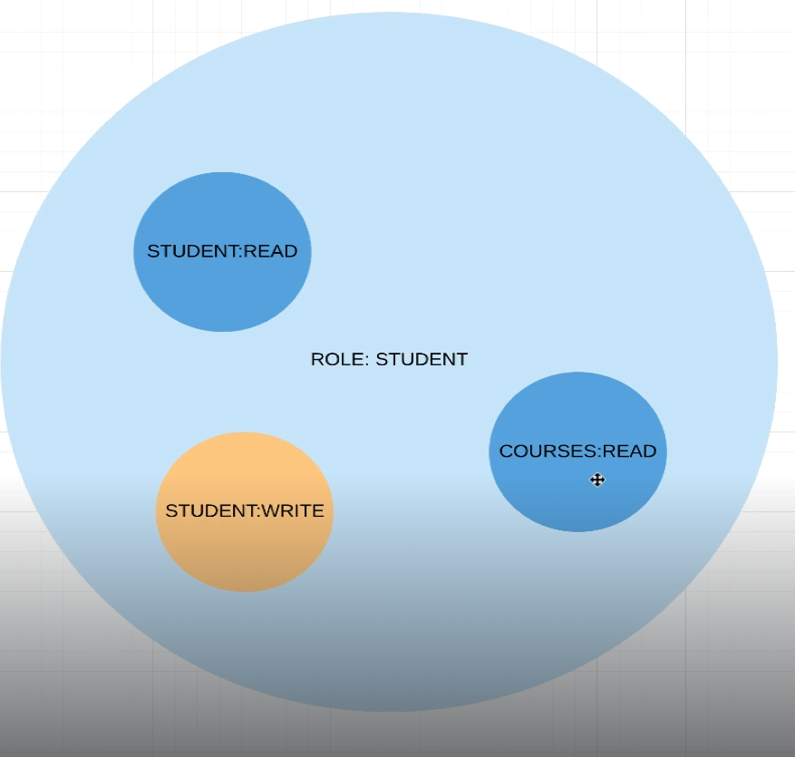

# Spring-Security

##  Prerequisites

To work with Spring Security Tutorial

- JDK 11.0.24
- Maven 3.8.8

## Getting Started

After Creating the project with Spring Initialize, we choose these parameters

- Java 11
- Spring Web

### Adding Student Package

We Add Student RestController and model inside Student Package to the project 


### testing the Endpoint

**http://localhost:8080/api/v1/students/1**


## Setting Spring Security 

### Adding Spring Security dependency to the pom.xml file

```xml
<dependency>
    <groupId>org.springframework.boot</groupId>
    <artifactId>spring-boot-starter-security</artifactId>
</dependency>
```

### re-running the application 


### refreshing the browser


### Credentials :

UserName : user 

Password : c462e42e-8eb4-4ee1-a41e-5a6b03331850

****Result (200 Sucess :+1: )****


****Logout****

**http://localhost:8080/logout**


****inspect****


this is an example of form-based authentication


### Basic Auth


#### we add the security package, and we implement the application securityConfig


****Result****


for basic auth the username & password are sent on every single request so we cannot use Logout

****Using Postman to test the application****


if we decode the selected text after **Basic** , we find 

```
# username:password

user:df088746-2018-40cb-a5cf-66273a1335e2
```

### Ant Matchers 

we use ant matchers to white-list some uri with security

by adding index.html inside static folder and whitelisting the route of index, we don't need to
specify the username and the password


## Users,Role & Authorities


### Creating In Memory Users

we use the interface `UserDetailsService` inside the ApplicationSecurityConfig Class to create 3 
in memory users to which we assign a different role for each 


### Result 

when login with these credentials we get 


We need to define a password encoder , by implementing `PasswordEncoder` interface and adding 
an encoder in our case we choose `BCryptPasswordEncoder` 

### Result


We have to  add the `PasswordEncoder` By injecting it to the ApplicationSecurityConfig to be able to use it

### Roles Definition 

</img>

</img>

trying to separate Api for each role 

```java
// By adding this to Security Config we enforce only users with role STUDENT to access the route "/api/**"

.antMatchers("/api/**").hasRole(STUDENT.name())

```

### Result (403 :-1: )

trying to access the route with Linda that has the Role ADMIN


## Permission Based Authentication

We Implement the StudentManagementController by adding the methods of REST API : 

**(GET / POST / PUT / DELETE)**


When we try to **POST / PUT / DELETE** Spring Security will automatically protect our App

To resolve this we need to **disable CSRF** `(Cross-site request forgery)` in the security Config

```java
http.csrf().disable()
```

### Result (200 Sucess :+1: )


### To Implement Permission based authentication there are 2 ways :

- Using AntMatchers in Application Security Config
- Using Annotations in the methods 


### 1- Using AntMatchers in Application Security Config

if we go deep into User Class we will find 


We will find that thr roles are GrantedAuthorities preceded only with "ROLE_"
and that is the only difference with Permissions 

If we go deep inside UserDetails interface, we will find that it uses only GrantedAuthorities


### Conclusion

If We want to define roles based on GrantedAuthorities we have to do it by ourselves 
inside the Role Enum as bellow 

```java
public Set<SimpleGrantedAuthority> getGrantedAuthorities() {
    Set<SimpleGrantedAuthority> permissions  = getPermissions().stream()
                                               .map(permission -> new SimpleGrantedAuthority(permission.getPermission()))
                                               .collect(Collectors.toSet());
    permissions.add(new SimpleGrantedAuthority("ROLE_" + this.name()));
    return permissions;
}
```

After changing the Application Sercurity Config 


### Result 

- annasmith can only access [localhost:8080/api/v1/students/{StudentId}]()
- tom can only acess GET [localhost:8080/management/api/v1/students]()
- linda can do everything in [localhost:8080/management/api/v1/students]()

### Important:

**AntMatchers order is crucial and can influence the application ,
Rememeber to always structure your antMatchers from Specific cases before the more generic cases**


### 2- Using Annotations on method level

We comment the antMatchers Part 


and instead we use 


#### Example 1:

```java
@GetMapping
@PreAuthorize("hasAnyRole('ROLE_ADMIN', 'ROLE_ADMINTRAINEE')")
public List<Student> getAllStudents() {
    System.out.println("getAllStudents");
    return STUDENTS;
}
```

#### Example 2:

```java
@PostMapping
@PreAuthorize("hasAuthority('student:write')")
public void registerNewStudent(@RequestBody Student student) {
    System.out.println("registerNewStudent");
    System.out.println(student);
}
```

**We also have to add this annotation on the `ApplicationSecurityConfig` or the`StudentManagementController`
( preferably `ApplicationSecurityConfig`) to inform our configuration that we are using @PreAuthorize
for permission or role based authentication**

```java
@EnableGlobalMethodSecurity(prePostEnabled = true)
```

### Result (Success :+1:)

## Cross Site Request Forgery


Spring Security by default activates the csrf protection as bellow


### When to use CSRF Protection :

CSRF Protection should be used for any request that could be processed by a browser
by normal users, Although if we are creating a service used by non-browser 
clients, we would likely disable the CSRF Protection


- CSRF protection is enabled by default in Spring Security. However, if you have explicitly 
disabled it, or it's not correctly configured, the token will not be generated.

- Use CookieCsrfTokenRepository.withHttpOnlyFalse() to ensure that the CSRF token is stored in 
a cookie that can be accessed by the client-side.

- we get the **XSRF-TOKEN** in a `GET` to be used in `POST` / `PUT` / `DELETE` 


```java
// Enable the CSRF token to be set as a cookie
 http   
     .csrf()
     .csrfTokenRepository(CookieCsrfTokenRepository.withHttpOnlyFalse())
     .and()
     .authorizeRequests()
```

#### Result (without XSRF-TOKEN :-1: ) 


#### Result (with XSRF-TOKEN :1+: ) 

if we use the **XSRF-TOKEN** in the header of our request 


### withHttpOnlyFalse() method

```java
//means that the coookie will be inaccessible to the client side scripts 
// (ex: javascript)

public static CookieCsrfTokenRepository withHttpOnlyFalse() {
    CookieCsrfTokenRepository result = new CookieCsrfTokenRepository();
    result.setCookieHttpOnly(false);
    return result;
}
```

Emphasize on `CookieCsrfTokenRepository` and `CsrfFilter`

**We will be working with services with Postman , which requires us to disable the CSRF**

## Form Based Authentication

### Comparison between Basic Auth and Form Auth


### Enabling Form-Based Authentication

we change the `BasicAuth()` method with the `Formlogin()`in the Security Config

```java
    @Override
    protected void configure(HttpSecurity http) throws Exception {
        http
                .csrf().disable()
                .authorizeRequests()
                .antMatchers("/", "index", "/css/*", "/js/*").permitAll()
                .antMatchers("/api/**").hasRole(STUDENT.name())
                .anyRequest()
                .authenticated()
                .and()
                .formLogin();
    }
```

#### Result


#### Result After Login we get JSESSIONID inside the cookie


 

- The Default time of this session is about 30min

- By default, Spring Security uses 
  - In Memory DataBase to store the SESSION ID
  - We can also use other sources like PostgeSQL or Redis


### Custom Login Page

We Add the `loginPage("/login")` in the Security Config 

```java
http.
.
.
.

.and()
.formLogin()
.loginPage("/login");
```

We also add Thymeleaf dependency in the pom.xml file 

`Thymeleaf is a templating engine to handle html files`


```xml
<dependency>
  <groupId>org.springframework.boot</groupId>
  <artifactId>spring-boot-starter-thymeleaf</artifactId>
</dependency>
```

<u>**Always Remember to reload and clean-build you Project**</u>

We add the login.html file inside template folder and create a custom login page

We add the **TemplateController** class inside **controller** Package ,
and add routes for **login** and **courses**

We Permit all to be able to access the loginPage

```java
.formLogin()
.loginPage("/login").permitAll();
```


### Redirect After Success Login

- We add the `courses.html` Web Page to the template folder 

We update the redirect after successful login to the course page 

```java
.formLogin()
.loginPage("/login").permitAll()
.defaultSuccessUrl("/courses", true);
```

#### Result ( Success :+1:)


### Remember Me 

- By default, the SESSION_ID will expire after 30min of inactivity

- Spring offers to extend this duration with the <u>`Remember Me`</u>

- Default duration of `Remember Me` is **2 weeks**

We add the Remember Me to the security Config

```java
.formLogin()
.loginPage("/login").permitAll()
.defaultSuccessUrl("/courses", true)
.and()
.rememberMe();
```

- We also add the Remember Me checkbox to the login.html Page 

- add `name=remember-me` inside the html checkbox element

#### Result ( Success :+1: )


### Remember Me Cookie and Extra Options


- **Notice that we have two cookies now (`JSESSIONID` & `remember-me`)**

- `remember-me` expires 2 weeks after the date 06-09-2024 (by default)


**Remember-me cookie contains these informations :**

- username

- expiration time

- md5 hash of the (username & expiration time )


In this we will parameter the lifespan of the remember me cookie to expire after 21 day,
we are also parameterizing the key in which md5 hash is generated


we add the rememberMe parameters to the security config

```java
.and()
.rememberMe()
  //.tokenRepository();example
    .tokenValiditySeconds((int)TimeUnit.DAYS.toSeconds(21))
    .key("something-very-secured");
```

### Logout

we add the logout method to the security config with other parameters

```java
.and()
.logout()
    .logoutUrl("/logout")
    .clearAuthentication(true)
    .invalidateHttpSession(true)
    .deleteCookies("JSESSIONID", "remember-me")
    .logoutSuccessUrl("/login");
```

**when we log out from the application we notice that JSESSIONID & remember-me cookies 
are deleted, and we are redirected to login page**


```java
.and()
.logout()
    .logoutUrl("/logout")
    .logoutRequestMatcher(new AntPathRequestMatcher("/logout", "GET"))
    .clearAuthentication(true)
    .invalidateHttpSession(true)
    .deleteCookies("JSESSIONID", "remember-me")
    .logoutSuccessUrl("/login");
```

**We Add the logout button in the courses html page**

```html
<div class="container">
    <p>Spring Boot Security</p>
    <form class="form-signin" method="get" action="/logout">
        <button class="btn btn-primary btn-block" type="submit">Logout</button>
    </form>
</div>
```

## DataBase Authentication

### Architecture


Explore `UserDetailsService` Interface  & `JdbcDaoImpl` Implementation of it

### ApplicationUser Model

- Explore `UserDetails` Interface

- Creating the auth Package

- Creating the `ApplicationUser` class by implementing `UserDetails`


### ApplicationUserService

- Creating the `ApplicationUserService` class annotated with `@Service` and implementing `UserDetailsService`

### ApplicationUserDao 

- Creating the `ApplicationUserDao` Interface

- Adding `selectApplicationUserByUsername` method to it

### FakeApplicationUserDaoService

- Creating the `FakeApplicationUserDaoService` Class annotated with `@Repository` and implementing `ApplicationUserDao`

- implementing the `selectApplicationUserByUsername` method

- creating `getApplicationUsers()`  to create fixture users


### DaoAuthenticationProvider

- We replace `userDetailsService()` method inside the security config **[(In Memory users List)]()** with
  `getApplicationUsers()` **[(DataBase Users List)]()** method from `FakeApplicationUserDaoService` class 


```java

// here we are configuring the autheticationManager by setting the AuthenticationProvider that we just implemented
@Override
protected void configure(AuthenticationManagerBuilder auth) throws Exception {
    auth.authenticationProvider(daoAuthenticationProvider());
}

@Bean
public DaoAuthenticationProvider daoAuthenticationProvider() {
    DaoAuthenticationProvider provider = new DaoAuthenticationProvider();
    //this line allows passwords to be decoded 
    provider.setPasswordEncoder(passwordEncoder);
    // we set the userDetailsService parameter with ApplicationUserService that we created
    provider.setUserDetailsService(applicationUserService);
    return provider;
}
```

`configure(AuthenticationManagerBuilder auth)`

- This is a method used to configure the `AuthenticationManagerBuilder`, which is responsible for 
setting up the authentication mechanism for our application

`auth.authenticationProvider(daoAuthenticationProvider())`

- This line sets the authentication provider for the application. The authentication provider is what 
  handles the logic of verifying the credentials (like username and password) provided by the user.

  
### Conclusion

- The configure method sets up Spring Security to use a `DaoAuthenticationProvider` for authentication.
- The `DaoAuthenticationProvider` uses a `passwordEncoder` to verify passwords and a `UserDetailsService` 
  (`applicationUserService`) to load user details from a data source (typically a database).
- This setup ensures that when a user logs in, Spring Security will check the provided credentials against
  stored data using the `DaoAuthenticationProvider`, which securely handles password encoding and validation.

#### Result (Login Successful with the new Security Config :+1:)


